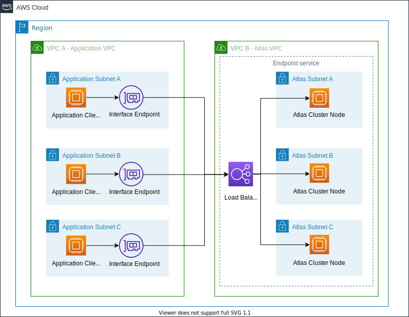

# quickstart-mongodb-atlas 



# How to run this
## Setup AWS & API Keys

If needed, install the awscli and mongocli.

```bash
curl "https://awscli.amazonaws.com/awscli-exe-linux-x86_64.zip" -o "/tmp/awscliv2.zip"
unzip /tmp/awscliv2.zip
sudo /tmp/aws/install
MONGOCLI_VERSION="1.7.0"
curl -L "https://github.com/mongodb/mongocli/releases/download/${MONGOCLI_VERSION}/mongocli_${MONGOCLI_VERSION}_linux_x86_64.tar.gz" -o "/tmp/mongocli_${MONGOCLI_VERSION}_linux_x86_64.tar.gz"
tar xzvf "/tmp/mongocli_${MONGOCLI_VERSION}_linux_x86_64.tar.gz" --directory /tmp
cp "/tmp/mongocli_${MONGOCLI_VERSION}_linux_x86_64/mongocli" "~/.local/bin"
~/.local/bin/mongocli --version
```

Make sure to configure each tool properly.

```bash
aws configure
mongocli config
```

+ Run this helper to setup environment variables for your 
MongoDB Atlas API keys (read from mongocli config)

```bash
source <(./scripts/export-mongocli-config.py)
```

## Deploy the MongoDB Cloud Resource Manager into AWS

This quickstart is powered by a lightweight lambda-controller
which connects your AWS CloudFormation control plane directly into
the MongoDB Cloud. Run this command to install the Resource Manager 
into the `AWS_REGION` of your choice before running the quickstart.

```bash
aws cloudformation create-stack \
  --template-body file://templates/mongodbatlas-resource-manager.template.yaml \
  --capabilities CAPABILITY_IAM \
  --stack-name mongodbatlas-resource-manager 
```

# Launch the quickstart stack

The `templates/mongodbatlas-quickstart.template.yaml` stack will 
provision a complete you MongoDB Atlas Deployment for you. This includes
the follow resources
* MongoDB Atlas Project
* MongoDB Atlas Cluster
* AWS IAM Role Integration 
* MongoDB Atlas DatabaseUser (AWS IAM) 

__NOTE__ Never keep your apikey or secrets in plain text. Don't do this and use secrets.

```bash
source <(./scripts/export-mongocli-config.py)
env | grep ATLAS && \
aws cloudformation create-stack \
  --capabilities CAPABILITY_IAM \
  --disable-rollback \
  --template-body file://templates/quickstart-mongodb-atlas.template.yaml \
  --parameters ParameterKey=PublicKey,ParameterValue=${ATLAS_PUBLIC_KEY} \
               ParameterKey=PrivateKey,ParameterValue=${ATLAS_PRIVATE_KEY} \
               ParameterKey=OrgId,ParameterValue=${ATLAS_ORG_ID} \
  --stack-name mongodb-atlas-quickstart
```

The stack will take ~7-10 minutes to provision. When complete you can find the `mongodb+srv` connection information in the stack outputs.

```
aws cloudformation describe-stacks --stack-name ${STACK_NAME} | jq -r '.Stacks[0]|.Outputs'
```

Currently there are 3 outputs:
```
[
  {
    "OutputKey": "AtlasDatabaseUser",
    "OutputValue": "org:5ea0477597999053a5f9cbec,project:5f8723ae20f10f128d3d6a07",
    "Description": "AWS IAM ARN for database user"
  },
  {
    "OutputKey": "SrvHost",
    "OutputValue": "mongodb+srv://cookies-99-5x.cqpb3.mongodb.net",
    "Description": "Hostname for mongodb+srv:// connection string",
    "ExportName": "cookies-99-5x-standardSrv"
  },
  {
    "OutputKey": "AtlasDeployment",
    "OutputValue": "org:5ea0477597999053a5f9cbec,project:5f8723ae20f10f128d3d6a07",
    "Description": "Info on your Atlas deployment"
  }
]
```

## Connect to your database

After the cluster provisions, you can connect with the `mongo` shell or MongoDB Compass.

Fetch the new cluster `mongodb+srv://` host info:

```bash
STACK_NAME="mongodb-atlas-quickstart"
MDB=$(aws cloudformation list-exports |\
 jq -r --arg stackname "${STACK_NAME}" \
 '.Exports[] | select(.Name==$stackname+"-standardSrv") | .Value')
echo "New ${STACK_NAME} database url: ${MDB}"
```
Use this url along with your `aws` cli credentials to seamlessly and securly connect to your new MongoDB Atlas database:

```bash
STACK_ROLE=$(aws cloudformation describe-stack-resources --stack-name "${STACK_NAME}" --logical-resource-id AtlasIAMRole)
ROLE=$(aws iam get-role --role-name $( echo "${STACK_ROLE}" | jq -r '.StackResources[] | .PhysicalResourceId'))
ROLE_ARN=$(echo "${ROLE}" | jq -r '.Role.Arn')
ROLE_CREDS=$(aws sts assume-role --role-session-name test --role-arn ${ROLE_ARN})
mongo "${MDB}/${STACK_NAME}?authSource=%24external&authMechanism=MONGODB-AWS" \
    --username $(echo "${ROLE_CREDS}" | jq -r '.Credentials.AccessKeyId') \
    --password $(echo "${ROLE_CREDS}" | jq -r '.Credentials.SecretAccessKey') \
    --awsIamSessionToken $(echo "${ROLE_CREDS}" | jq -r '.Credentials.SessionToken')
```

see [scripts/aws-iam-mongo-shell.sh](scripts/aws-iam-mongo-shell.sh).
